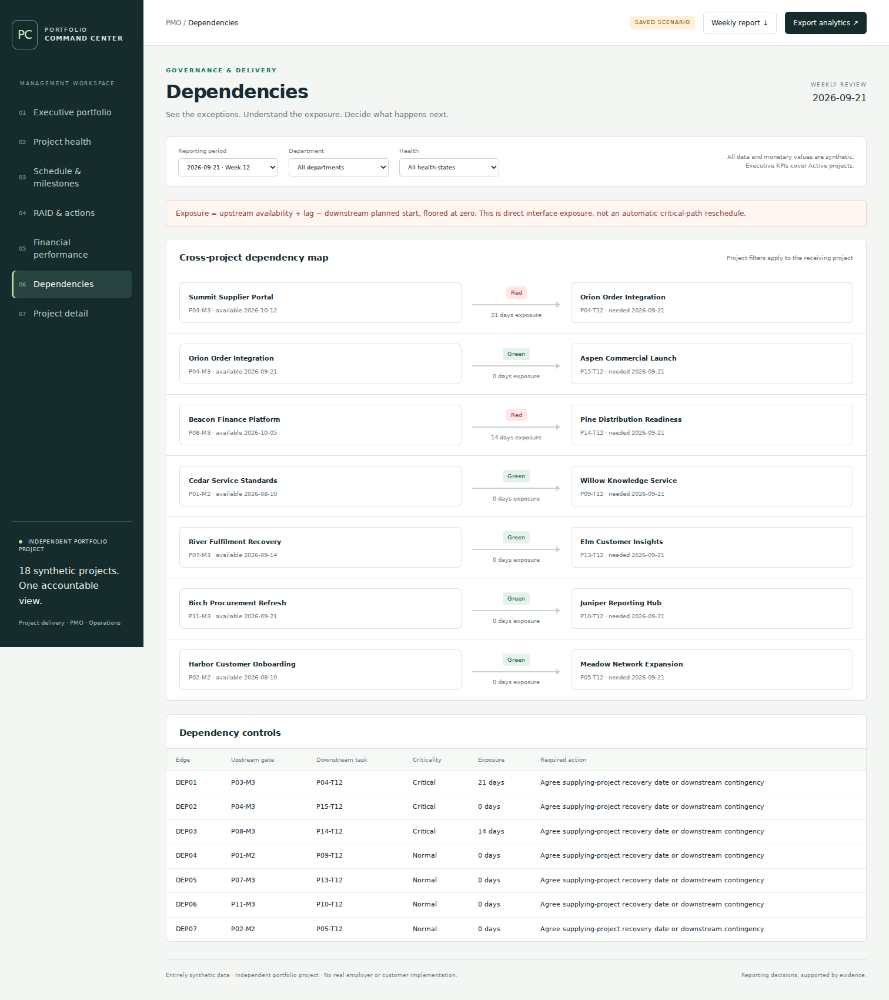
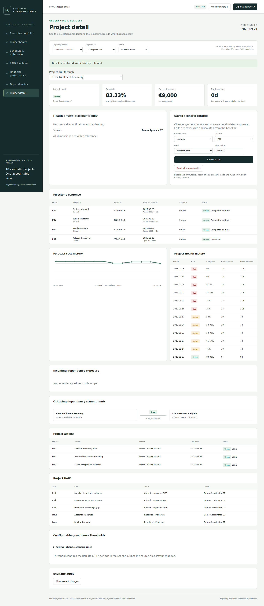
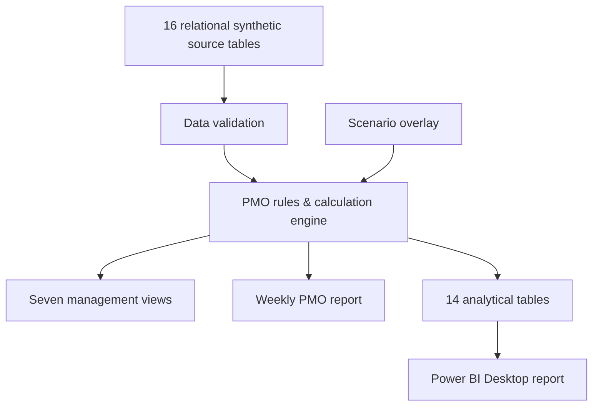

# PMO Portfolio Command Center

**Portfolio governance · Project controls · RAID · Financials · Dependencies · Resource visibility**

A portfolio-level PMO command center that turns project, milestone, RAID, financial, resource and dependency data into **management-ready portfolio visibility**.

Built around a synthetic portfolio of **18 projects across 7 departments and 12 weekly reporting periods**, with configurable health rules, scenario analysis, cross-project dependency exposure and reproducible weekly reporting.

> **Independent portfolio project:** All data is synthetic. This project does not represent an implementation for a real employer or customer.


## Skills demonstrated

**PMO & Delivery:** Portfolio governance · Project health · RAID management · Milestone tracking · Dependency management · Resource visibility · Financial monitoring · Executive reporting

**Analytics:** KPI design · Scenario analysis · Data modelling · Power BI · DAX · Power Query

**Technical:** Python · SQL/SQLite · JavaScript · Git/GitHub · Automated validation

## System preview

### Cross-project dependency analysis



### Project-level investigation



## Power BI report preview

The repository also includes a completed Power BI Desktop implementation of the portfolio model.

### Executive Portfolio


### Project Health


### Schedule & Milestones


### RAID & Actions


### Financial Performance


### Dependencies


### Project Detail


## Start in one command

With Python 3.12+ installed, run from the repository folder:

```powershell
python run.py
```

Then open:

```text
http://localhost:8765
```

No pip runtime packages, credentials, paid API or external service connection are required.

See the [Windows setup and optional Docker instructions](docs/setup-guide.md) for additional setup information.

## Business problem

Portfolio reporting becomes difficult when project status, RAID records, financial information, milestones, resource allocations and dependencies are maintained separately.

A portfolio summary is only useful if a PMO can explain the status, identify an accountable owner, trace the underlying evidence and connect an exception to a management decision.

This project combines normalized project records with explicit governance rules to create a consistent portfolio view.

For example:

- a delayed upstream milestone is connected to the downstream activity that depends on it;
- financial health is backed by approved budget, actual spend and forecast values;
- risks, issues and overdue actions remain connected to accountable owners;
- shared-resource allocations can be reviewed across projects;
- weekly reports are generated from the same calculations used by the management interface.

The goal is not to automate project-management judgment. The system provides **structured evidence for governance, exception analysis and management decisions**.

## What the system can do

- Filter the portfolio by reporting period, department and health status.
- Drill from portfolio-level indicators into individual projects.
- Inspect milestone baselines, forecasts, actual completion and overdue gates.
- Review risks, issues, assumptions, actions, ownership, age and escalation.
- Follow upstream milestone → downstream task dependency relationships.
- Quantify direct schedule exposure between dependent projects.
- Reconcile cumulative actual spend with underlying transactions.
- Compare forecast spend with approved project budgets.
- Identify shared-resource overload across departments and projects.
- Save reversible synthetic scenario changes with revision checks and an audit trail.
- Modify health thresholds and observe recalculated portfolio results.
- Review historical project-health evolution across reporting periods.
- Export analytical datasets.
- Generate a reproducible weekly PMO management report.

## Running-system validation

The Python service and calculation engine were executed and tested.

Automated validation covers:

- source-data integrity;
- financial reconciliation;
- health-rule boundaries;
- dependency joins;
- historical reporting periods;
- scenario persistence;
- HTTP requests;
- DOM/API integration;
- interface behaviour;
- scenario edits and resets;
- filters;
- responsive/mobile overflow.

Screenshots in this repository were captured from the running application rather than created as mockups.

Detailed evidence is available in:

- [Test results](docs/test-results.md)
- [Browser test evidence](docs/browser-test-results.json)
- [UI/API evidence](docs/ui-test-results.json)
- [Quality gate](docs/quality-gate.md)

### Power BI implementation

The Power BI Desktop implementation has been assembled and validated locally against the supplied analytical model.

The completed report contains seven management pages:

- Executive Portfolio;
- Project Health;
- Schedule & Milestones;
- RAID & Actions;
- Financial Performance;
- Dependencies;
- Project Detail.

A separate QA page was used to reconcile the latest reporting-period outputs against the repository validation totals.

The Desktop model uses **14 typed analytical data queries, 22 active single-direction relationships, DAX measures, the supplied report theme and validation totals**.

For the latest reporting period (**2026-09-21**), the Power BI outputs were reconciled to `validation-expected.csv`, including:

- 15 Active projects;
- 4 Green, 3 Amber and 8 Red;
- €6,775,000 approved budget;
- €5,888,268 actual spend;
- €7,079,750 forecast spend;
- €304,750 / 4.50% forecast variance;
- 8 overdue milestones;
- 4 critical overdue milestones;
- 2 dependency exposures;
- 4 overloaded shared resources.

The final `.pbix` was saved and reopened successfully in Power BI Desktop.

> **Data disclosure:** All portfolio data shown in the Power BI report is synthetic and created solely for this independent portfolio project.

## Portfolio scenario

The synthetic portfolio contains deliberately different project situations so that portfolio-management behaviour can be demonstrated.

| Project story | Evidence and management question |
|---|---|
| **Summit Supplier Portal → Orion Order Integration** | P03-M3 is available 5 October while P04-T12 requires it 21 September, creating 14 days of direct dependency exposure. |
| **Meadow Network Expansion** | Forecast cost is 25% above approved budget, requiring containment, scope or funding review. |
| **Atlas Access Controls** | An unmitigated critical risk requires mitigation ownership and evidence. |
| **River Fulfilment Recovery** | Health improves from Red to Green across the reporting history alongside recorded budget and forecast changes. |
| **Beacon Finance Platform** | Schedule, risk and financial indicators deteriorate over time. |
| **Laurel / Olive** | Completed projects retain historical delivery evidence while leaving Active executive totals. |
| **Acacia Operating Model** | On Hold remains visible in the portfolio without being counted as active delivery. |

## Latest baseline

Reporting period: **2026-09-21**

| Measure | Result |
|---|---:|
| Projects | 18 |
| Active | 15 |
| Completed | 2 |
| On Hold | 1 |
| Active Green | 4 |
| Active Amber | 3 |
| Active Red | 8 |
| Approved Active budget | €6,775,000 |
| Actual Active spend | €5,888,268 |
| Forecast Active spend | €7,079,750 |
| Forecast variance | €304,750 / 4.50% |
| Overdue milestones | 8 |
| Critical overdue milestones | 4 |
| Exposed incoming dependencies | 2 |
| Overloaded shared resources | 4 |

> These figures are simulated portfolio data and are not organisational or employer results.

Every reporting period contains its own source facts and computed outputs.

## Architecture



The runtime uses:

- Python standard library;
- SQLite for scenario state;
- local HTML/CSS/JavaScript;
- optional Node.js/jsdom/Playwright for interface testing;
- optional Docker packaging.

Docker is not required to run the application.

## Data model

Source entities include:

- projects;
- departments;
- people;
- coordinators and sponsors;
- resources;
- reporting periods;
- statuses;
- budgets;
- cost transactions;
- tasks;
- milestones;
- risks;
- issues;
- actions;
- assumptions;
- dependencies;
- allocations.

The processed analytical model separates facts from dimensions rather than relying on one large flattened dataset.

Dimensions include:

- project;
- reporting period;
- resource;
- upstream-project role.

The historical model contains **216 project-period records** across 12 reporting periods.

See:

- [Architecture](docs/architecture.md)
- [Data model](docs/data-model.md)

## Health and KPI logic

Overall project health is determined from eight transparent dimensions:

1. Schedule
2. Cost
3. Risk
4. Issues
5. Milestones
6. Dependencies
7. Actions
8. Reporting freshness

Overall health reflects the most severe applicable dimension.

Example configurable thresholds include:

- schedule Amber at 5 days;
- schedule Red at 14 days;
- forecast cost Amber at 5%;
- forecast cost Red at 15%;
- immediate Red for a critical overdue milestone;
- immediate Red for an unresolved critical issue;
- Red for open risk exposure ≥20 where mitigation has not started.

See [Business rules](docs/business-rules.md) for the exact formulas and exceptions.

Headline KPIs are designed to answer practical management questions:

- How much work is currently active?
- Which projects require intervention?
- Which milestones or actions are overdue?
- Where is forecast funding exposed?
- Which dependencies require coordination?
- Where are shared resources overloaded?

Lifecycle status is intentionally separated from project health.

Task completion is unweighted, and the project does **not** claim earned-value management metrics.

## Seven management views

### 1. Executive Portfolio

Portfolio health, financial position, historical trends, management exceptions and shared-resource constraints.

### 2. Project Health

Department comparison, project register and configurable health thresholds.

### 3. Schedule & Milestones

Milestone status, overdue gates, critical milestones, schedule variance and completed-milestone performance.

### 4. RAID & Actions

Risks, issues, assumptions, actions, ownership, ageing and escalation.

### 5. Financial Performance

Approved budget, planned cost, actual spend, forecast spend and reconciled variance.

### 6. Dependencies

Direct project-to-project dependency relationships and quantified exposure.

### 7. Project Detail

Project evidence, historical health, scenario controls, audit information and accountability.

The same management views are implemented in Power BI and documented in the [Power BI implementation guide](powerbi/README.md).

The Power BI implementation uses **14 typed analytical data queries, 22 model relationships, DAX measures, the supplied report theme and validation totals**. The seven-page Desktop report has been assembled and validated locally.

## Demonstration scenario

A simple scenario demonstrates how the system connects a project change to portfolio-level exposure.

1. Open project **P03** in Project Detail.
2. Locate milestone `P03-M3`.
3. Change its forecast date from **2026-10-05** to **2026-10-12**.
4. Save the scenario.
5. Open the Dependencies view.
6. Observe P03 → P04 dependency exposure change from **14 days to 21 days**.
7. Reset the scenario.
8. Review P07's historical recovery.
9. Generate the weekly PMO report.

See the [latest generated weekly report](examples/weekly-report-2026-09-21.md).

## Rebuild and test

Rebuild the deterministic baseline and analytical assets with:

```powershell
python scripts/build.py
python scripts/powerbi_assets.py
```

Run the Python validation suite with:

```powershell
python -m unittest discover -s tests -v
python scripts/test_report.py
```

UI tests use a running disposable local instance.

See [Testing](docs/testing.md) for the full testing workflow.

## Repository structure

```text
src/pmo/          PMO validation, calculations, scenarios, reports and local server
dashboard/        Seven-view HTML/CSS/JavaScript management interface
config/           Governance and health thresholds
data/raw/         Relational synthetic source datasets
data/processed/   Analytical tables and KPI validation outputs
data/historical/  Computed weekly portfolio evidence snapshots
powerbi/          Power BI report, Power Query, DAX, relationships, theme and specifications
tests/            Python, DOM/API and browser integration checks
scripts/          Build, asset generation, evidence and repository checks
docs/             Requirements, architecture, business rules, setup, security and QA
examples/         Reproducible weekly management reports and KPI outputs
screenshots/      Captures from the running application and Power BI Desktop report
```

## Security and privacy

The application is designed as a local portfolio project.

The server binds to loopback by default.

Write operations require:

- a session token;
- an acceptable Host/Origin;
- the current scenario revision.

No credentials, secrets or personal data are required.

The synthetic baseline cannot be modified directly through the interface; scenario changes are maintained separately.

See [Security notes](docs/security.md).

## Limitations

This project intentionally does **not** claim functionality that has not been implemented.

The current system does not provide:

- critical-path scheduling;
- earned-value management;
- automatic resource optimisation;
- recursive dependency rescheduling;
- automated recovery decisions;
- enterprise identity/access management;
- production authentication;
- encryption-at-rest;
- cryptographically signed audit records;
- multi-user enterprise operations.

Dependencies quantify direct exposure; people remain responsible for management decisions.

Health thresholds and scenario percentages are transparent portfolio assumptions rather than predictive models.

The seven-page Power BI Desktop report has been assembled and validated locally. The source-controlled Power Query, DAX, relationship, theme and validation assets remain available as the reproducible analytical handoff.

## Future extensions

Potential extensions within the same portfolio-governance scope include:

- governed source-system connectors;
- approval workflows for portfolio changes;
- persisted model versions;
- role-based access;
- retention policies;
- scheduled report distribution;
- additional executive reporting;
- governed portfolio snapshots.

These are future possibilities rather than implemented functionality.

## License

MIT license applies to this repository's original work.

Third-party tools retain their respective licenses.

**Independent portfolio project · Entirely synthetic data**
