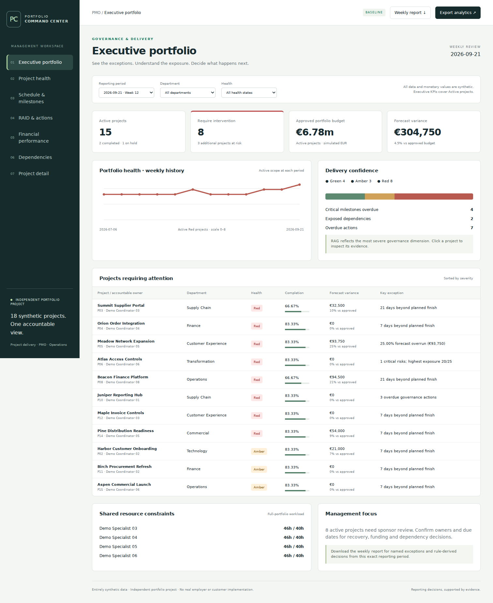
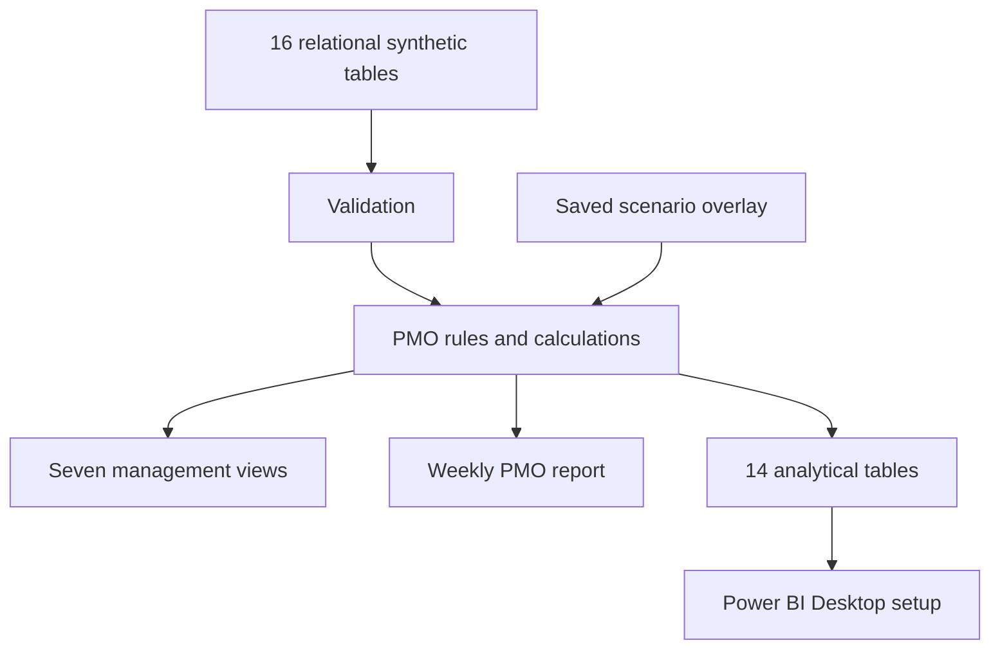

# PMO Portfolio Command Center

**INDEPENDENT PORTFOLIO PROJECT · Project delivery + PMO + Business operations**

A functioning local management system for **18 synthetic projects across seven departments and 12 weekly reporting periods**. Review portfolio health, investigate evidence, change synthetic assumptions, see cross-project exposure change and reproduce the weekly PMO report.

> This project uses entirely synthetic data and represents an independent portfolio project. It does not represent an implementation for a real employer or customer.



## Start in one command

With Python 3.12+ installed, from the extracted repository folder:

```powershell
python run.py
```

Open **http://localhost:8765**. No pip runtime packages, credentials, paid API or n8n connection are required. [Windows setup and optional Docker instructions](docs/setup-guide.md).

The existing delivery-automation project remains separate and unchanged. This repository implements **Project 1 only**; it contains no implementation of the future planning, resource-optimisation, process or recovery simulators.

## Business problem

A portfolio summary is only useful if a PMO can explain the colour, identify an accountable owner and connect the exception to a decision. Separate project lists, RAID logs and financial sheets can obscure cross-project dependencies and make weekly reporting inconsistent.

This system combines normalized source records with explicit governance rules. A delayed supplier gate is joined to the receiving project's activity; a red financial status is backed by forecast and approved-budget values; a report is generated from the same calculations as the interface and analytical exports.

## What you can do

- Filter by reporting period, department and health; drill into individual projects.
- Inspect milestone baselines, forecasts, actual completion and overdue gates.
- Review risk exposure, issues, action ownership, age and escalation.
- Follow real upstream-milestone/downstream-task dependency relationships.
- Reconcile cumulative actual spend with transactions and compare forecast with approved budget.
- Identify shared-resource overload without hiding allocations from other departments.
- Save reversible synthetic scenario edits with revision checks and an audit trail.
- Change health thresholds and observe the recalculated scenario history.
- Export analytical datasets and download a reproducible weekly management report.

Technology supports the professional story: **governance, project visibility, exception analysis and accountable decisions**. This is not a claim of employer deployment, realised savings or automated project-management judgment.

## Running-system validation

The Python service and calculations were executed. Automated tests cover source integrity, financial reconciliation, health boundaries, real dependency joins, history, scenario persistence and HTTP requests. DOM integration checks exercise the actual UI against the running API. Real local Chromium checks cover all seven views, edits, reset, filters and mobile overflow. Screenshots are captured from the actual application, not mockups.

See [test results](docs/test-results.md), [browser evidence](docs/browser-test-results.json), [UI/API evidence](docs/ui-test-results.json) and [quality gate](docs/quality-gate.md) for exact executed counts and limitations.

**Power BI boundary:** typed datasets, Power Query, DAX, relationships, theme and page specifications are supplied. No PBIX was fabricated. Power BI Desktop assembly and DAX/M execution are remaining local steps. Optional Docker runtime and Windows-specific execution were not available in the build environment; the Python launch path was verified on Linux.

## Portfolio scenario

| Project story | Evidence and decision |
|---|---|
| Summit Supplier Portal → Orion Order Integration | P03-M3 is available 5 October; P04-T12 needs it 21 September: 14 days direct exposure. Agree supplier recovery or receiving-project contingency. |
| Meadow Network Expansion | 25% forecast overrun: sponsor must choose containment, scope reduction or funding review. |
| Atlas Access Controls | Unmitigated critical risk: establish mitigation ownership and evidence. |
| River Fulfilment Recovery | Health improves from Red to Green across the 12 periods, with recorded budget and forecast changes. |
| Beacon Finance Platform | Schedule, risk and financial indicators deteriorate over time. |
| Laurel / Olive | Completed project records retain on-time/late history and leave Active executive totals. |
| Acacia Operating Model | On Hold remains visible without being counted as active delivery. |

Latest baseline, **2026-09-21**:

| Measure | Result |
|---|---:|
| Projects / Active / Completed / On Hold | 18 / 15 / 2 / 1 |
| Active Green / Amber / Red | 4 / 3 / 8 |
| Approved Active budget | €6,775,000 |
| Actual Active spend | €5,888,268 |
| Forecast Active spend | €7,079,750 |
| Forecast variance | €304,750 / 4.50% |
| Overdue / critical overdue milestones | 8 / 4 |
| Exposed incoming dependencies | 2 |
| Overloaded shared resources | 4 |

These figures are simulated, not organisational results. Every reporting period has its own source facts and computed outputs.

## Architecture and data model



Runtime: Python standard library, SQLite scenario state, local HTML/CSS/JavaScript. Tests optionally use Node.js, jsdom and Playwright. Docker is optional, not required infrastructure.

Source entities include projects, departments, people (coordinators and sponsors), resources, periods, statuses, budgets, cost transactions, tasks, milestones, risks, issues, actions, assumptions, dependencies and allocations. The processed model has separate facts and four dimensions: project, period, resource and upstream-project role. **216 project-period records** support history. No giant all-purpose flat CSV is used. [Architecture](docs/architecture.md) · [data model](docs/data-model.md).

## Health and KPIs

Overall health is the worst of eight transparent dimensions: schedule, cost, risk, issues, milestones, dependencies, actions and reporting freshness. Configurable rules default to schedule Amber at 5 days / Red at 14, forecast cost Amber at 5% / Red at 15%, and an immediate Red for a critical overdue milestone or unresolved critical issue. Open risk exposure ≥20 with mitigation not started is Red. [Exact formulas and exceptions](docs/business-rules.md).

Headline KPIs answer management questions: how much work is active, what needs intervention, which gates/actions are overdue, where forecast funding is exposed, and which dependencies/resources need attention. Counts and financial totals are Active-only; lifecycle is separate from health. Task completion is unweighted, and no earned-value metric is claimed.

## Seven management views

1. **Executive Portfolio** — active health, finance, history, exceptions and shared-resource constraints.
2. **Project Health** — department comparison, project register and configurable thresholds.
3. **Schedule & Milestones** — overdue/critical gates, variance and completed milestone performance.
4. **RAID & Actions** — risks, issues, assumptions, owners, age and overdue actions.
5. **Financial Performance** — approved, planned, actual and forecast values with reconciled variance.
6. **Dependencies** — direct project-to-project interface map and exposure evidence.
7. **Project Detail** — evidence, history, scenario controls, audit and accountability.

The same views are specified for Power BI in [the Desktop handoff](powerbi/README.md). **14 typed M queries, 22 relationships, DAX measures, theme and validation totals** are included; Desktop must assemble and validate the final Power BI report.

## Demonstrate it

Open P03 in Project Detail. Change milestone `P03-M3` forecast from **2026-10-05 to 2026-10-12**, then save. Open Dependencies: the P03 → P04 exposure changes from **14 to 21 days**. Reset the scenario, inspect P07's recovery history and download the weekly report.

[2-minute, 5-minute, technical and management demo scripts](docs/demo-guide.md) · [latest generated report](examples/weekly-report-2026-09-21.md).

## Rebuild and test

```powershell
python scripts/build.py
python scripts/powerbi_assets.py
python -m unittest discover -s tests -v
python scripts/test_report.py
```

The generators rebuild the deterministic baseline and Power BI assets. UI tests use a running disposable local instance; instructions are in [testing](docs/testing.md). Start the Python server again after regenerating its baseline.

## Repository

```text
src/pmo/          Source validation, calculations, scenarios, reports and local server
dashboard/        Implemented seven-view HTML/CSS/JavaScript interface
config/           Baseline governance thresholds
data/raw/         16 relational CSV tables and typed JSON bundle
data/processed/   14 analytical tables plus portfolio KPI validation output
data/historical/  12 computed weekly evidence snapshots
powerbi/          Typed queries, measures, relationships, theme and page specifications
tests/            Python, DOM/API and browser integration checks
scripts/          Rebuild, asset generation, evidence and package checks
docs/             Requirements, rules, setup, QA, demos and portfolio material
examples/         Reproducible weekly management reports and latest KPI output
screenshots/      Actual local-application captures
```

## Security, privacy and limitations

The server binds to loopback by default; writes require a session token, acceptable Host/Origin and current revision. No secrets or personal data are required. The synthetic baseline is immutable through the UI. This is a single-user local tool without accounts, production authentication, encryption-at-rest, audit signing or enterprise operations. [Security notes](docs/security.md).

No critical-path scheduling, earned-value control, resource optimisation, recursive dependency rescheduling or automated recovery decisions are implemented. Dependencies quantify direct exposure; humans decide how to respond. Percentages and health thresholds are transparent scenario assumptions rather than validated predictors. Power BI Desktop, Docker deployment and the user's Windows environment require their documented local checks.

Future improvements within portfolio governance could include approved-source connectors, governed change approval, persisted model versions, retention, access control and report subscriptions. Future portfolio projects remain separate and require explicit authorisation.

## CV, interview and LinkedIn package

[Exactly three defensible CV bullets, interview answers, short explanations, launch post and storyboard](docs/portfolio-package.md).

MIT license applies to this repository's original work. Third-party tools retain their own licenses. **Independent portfolio project; entirely synthetic data.**
