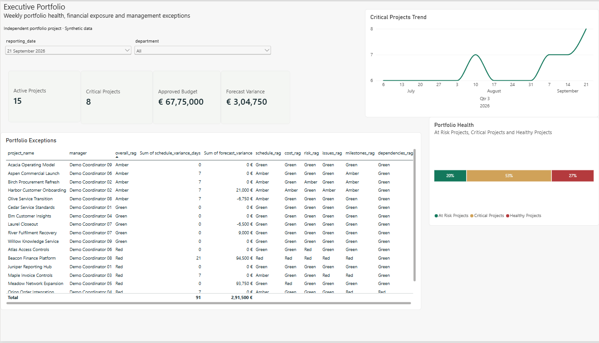
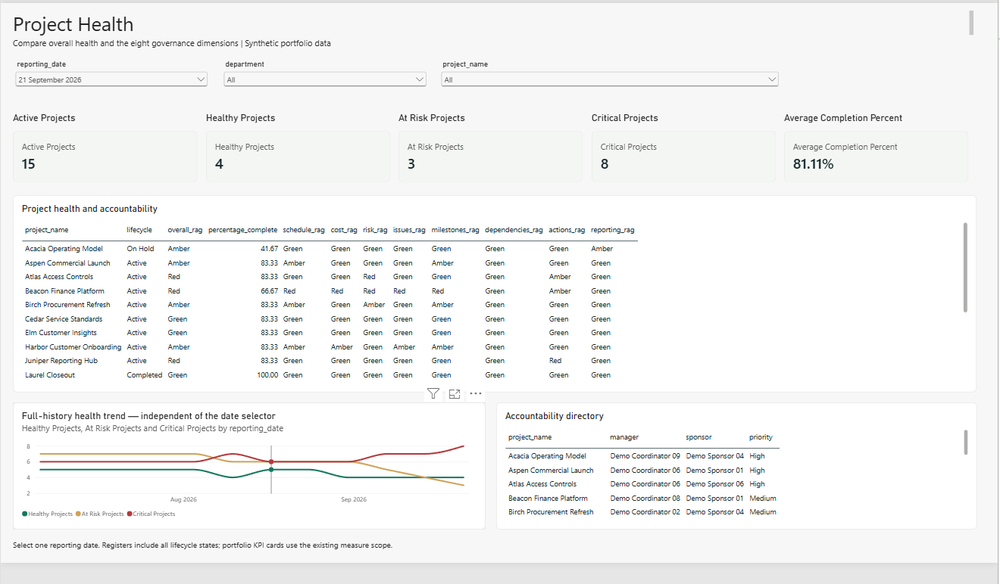
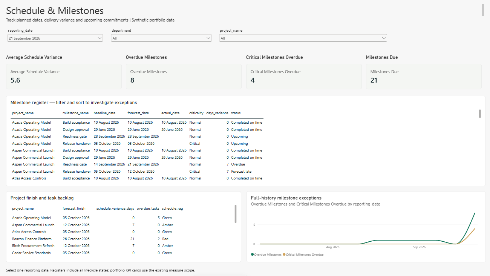
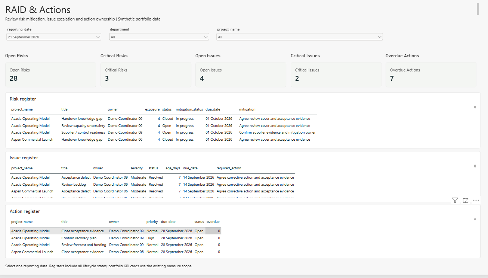
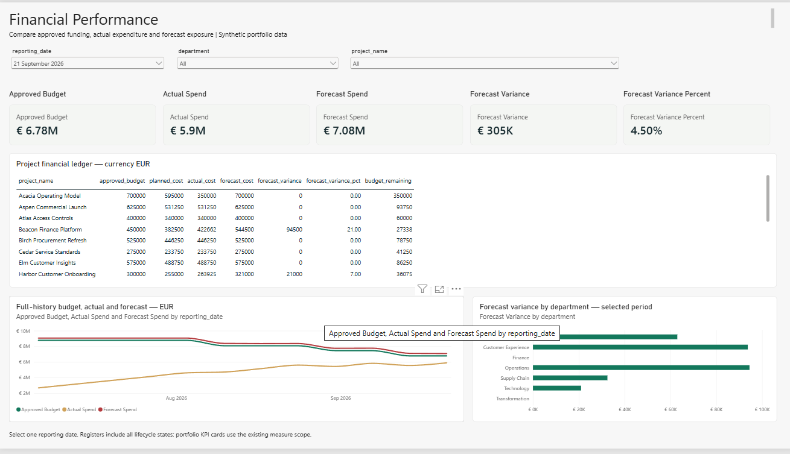
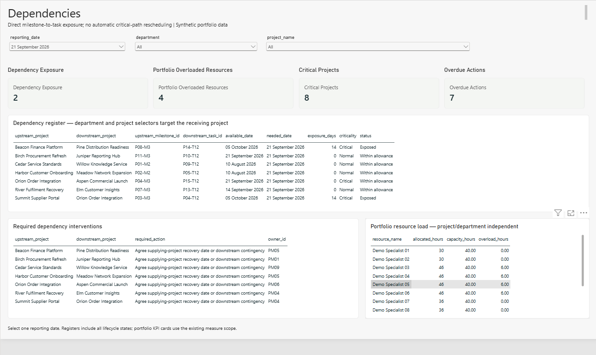
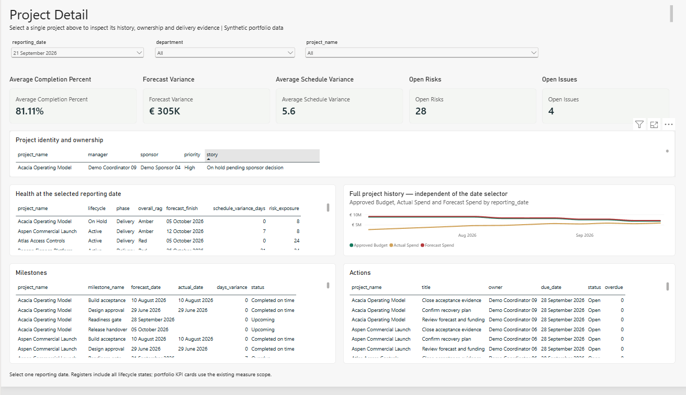
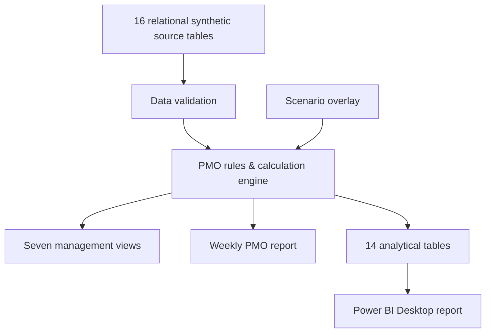

# PMO Portfolio Command Center

**Portfolio governance · Project controls · RAID · Financials · Dependencies · Resource visibility**

A portfolio-level PMO command center that turns project, milestone, RAID, financial, resource and dependency data into **management-ready portfolio visibility**.

Built around a synthetic portfolio of **18 projects across 7 departments and 12 weekly reporting periods**, with configurable health rules, scenario analysis, cross-project dependency exposure, reproducible weekly reporting and a completed Power BI Desktop implementation.

> **Independent portfolio project:** All data is synthetic. This project does not represent an implementation for a real employer, client or customer.


---

## Skills demonstrated

**PMO & Delivery:** Portfolio governance · Project health · RAID management · Milestone tracking · Dependency management · Resource visibility · Financial monitoring · Executive reporting

**Analytics:** KPI design · Scenario analysis · Data modelling · Power BI · DAX · Power Query

**Technical:** Python · SQL/SQLite · JavaScript · Git/GitHub · Automated validation

---

## System preview

### Cross-project dependency analysis


### Project-level investigation


---

# Power BI Report

The same portfolio model has been implemented as a completed **Power BI Desktop management report**.

The Power BI implementation uses the repository's processed analytical datasets, typed Power Query transformations, dimensional relationships, DAX measures, report theme and validation outputs.

The completed report contains **seven management-facing pages** plus a separate QA page used during validation.

## 1. Executive Portfolio

Portfolio-level health, financial position, historical movement and management exceptions.



## 2. Project Health

Project RAG status, governance drivers, department visibility and project-level accountability.



## 3. Schedule & Milestones

Schedule variance, milestone performance, overdue delivery gates and critical milestones.



## 4. RAID & Actions

Portfolio risks, issues, actions, ownership and escalation visibility.



## 5. Financial Performance

Approved budget, actual expenditure, forecast position and financial variance.



## 6. Dependencies

Cross-project dependency exposure and shared-resource constraints.



## 7. Project Detail

Selected-project delivery, schedule, financial, milestone, RAID and historical evidence.



---

## Start in one command

With Python 3.12+ installed, run from the repository folder:

```powershell
python run.py
```

Then open:

```text
http://localhost:8765
```

No pip runtime packages, credentials, paid API or external service connection are required.

See the [Windows setup and optional Docker instructions](docs/setup-guide.md) for additional setup information.

---

# Business problem

Portfolio reporting becomes difficult when project status, RAID records, financial information, milestones, resource allocations and dependencies are maintained separately.

A portfolio summary is only useful if a PMO can explain the status, identify an accountable owner, trace the underlying evidence and connect an exception to a management decision.

This project combines normalized project records with explicit governance rules to create a consistent portfolio view.

For example:

- a delayed upstream milestone is connected to the downstream activity that depends on it;
- financial health is backed by approved budget, actual spend and forecast values;
- risks, issues and overdue actions remain connected to accountable owners;
- shared-resource allocations can be reviewed across projects;
- weekly reports are generated from the same calculations used by the management interface;
- Power BI provides an additional management reporting layer over the analytical model.

The objective is not to automate project-management judgment.

The system provides **structured evidence for governance, exception analysis and management decisions**.

---

# What the system can do

- Filter the portfolio by reporting period, department and health status.
- Navigate from portfolio indicators into individual project evidence.
- Inspect milestone baselines, forecasts, actual completion and overdue gates.
- Review risks, issues, assumptions, actions, ownership, age and escalation.
- Follow upstream milestone → downstream task dependency relationships.
- Quantify direct schedule exposure between dependent projects.
- Reconcile cumulative actual spend with underlying transactions.
- Compare forecast spend with approved project budgets.
- Identify shared-resource overload across departments and projects.
- Save reversible synthetic scenario changes with revision checks and an audit trail.
- Modify health thresholds and observe recalculated portfolio results.
- Review historical project-health evolution across reporting periods.
- Export analytical datasets.
- Generate a reproducible weekly PMO management report.
- Analyse the portfolio through a seven-page Power BI Desktop report.

---

# Portfolio scenario

The synthetic portfolio contains deliberately different project situations so that portfolio-management behaviour can be demonstrated.

| Project story | Evidence and management question |
|---|---|
| **Summit Supplier Portal → Orion Order Integration** | P03-M3 is available 5 October while P04-T12 requires it 21 September, creating 14 days of direct dependency exposure. |
| **Meadow Network Expansion** | Forecast cost is 25% above approved budget, requiring containment, scope or funding review. |
| **Atlas Access Controls** | An unmitigated critical risk requires mitigation ownership and evidence. |
| **River Fulfilment Recovery** | Health improves from Red to Green across the reporting history alongside recorded budget and forecast changes. |
| **Beacon Finance Platform** | Schedule, risk and financial indicators deteriorate over time. |
| **Laurel / Olive** | Completed projects retain historical delivery evidence while leaving Active executive totals. |
| **Acacia Operating Model** | On Hold remains visible in the portfolio without being counted as active delivery. |

---

# Latest portfolio baseline

Reporting period: **2026-09-21**

| Measure | Result |
|---|---:|
| Projects | 18 |
| Active | 15 |
| Completed | 2 |
| On Hold | 1 |
| Active Green | 4 |
| Active Amber | 3 |
| Active Red | 8 |
| Approved Active budget | €6,775,000 |
| Actual Active spend | €5,888,268 |
| Forecast Active spend | €7,079,750 |
| Forecast variance | €304,750 / 4.50% |
| Overdue milestones | 8 |
| Critical overdue milestones | 4 |
| Exposed incoming dependencies | 2 |
| Overloaded shared resources | 4 |

> These figures are simulated portfolio data and are not organisational or employer results.

Every reporting period contains its own source facts and computed outputs.

---

# Architecture



The runtime uses:

- Python standard library;
- SQLite for scenario state;
- local HTML/CSS/JavaScript;
- optional Node.js/jsdom/Playwright for interface testing;
- optional Docker packaging.

Docker is not required to run the application.

---

# Data model

Source entities include:

- projects;
- departments;
- people;
- coordinators and sponsors;
- resources;
- reporting periods;
- statuses;
- budgets;
- cost transactions;
- tasks;
- milestones;
- risks;
- issues;
- actions;
- assumptions;
- dependencies;
- allocations.

The processed analytical model separates facts from dimensions rather than relying on one large flattened dataset.

Dimensions include:

- project;
- reporting period;
- resource;
- upstream-project role.

The historical model contains **216 project-period records** across 12 reporting periods.

See:

- [Architecture](docs/architecture.md)
- [Data model](docs/data-model.md)

---

# Health and KPI logic

Overall project health is determined from eight transparent dimensions:

1. Schedule
2. Cost
3. Risk
4. Issues
5. Milestones
6. Dependencies
7. Actions
8. Reporting freshness

Overall health reflects the most severe applicable dimension.

Example configurable thresholds include:

- schedule Amber at 5 days;
- schedule Red at 14 days;
- forecast cost Amber at 5%;
- forecast cost Red at 15%;
- immediate Red for a critical overdue milestone;
- immediate Red for an unresolved critical issue;
- Red for open risk exposure ≥20 where mitigation has not started.

See [Business rules](docs/business-rules.md) for the exact formulas and exceptions.

Headline KPIs answer practical management questions:

- How much work is currently active?
- Which projects require intervention?
- Which milestones or actions are overdue?
- Where is forecast funding exposed?
- Which dependencies require coordination?
- Where are shared resources overloaded?

Lifecycle status is intentionally separated from project health.

Task completion is unweighted, and the project does **not** claim earned-value management metrics.

---

# Power BI implementation

The Power BI Desktop implementation was assembled from the analytical assets contained in this repository.

## Model structure

The Desktop implementation uses:

- **14 typed analytical data queries**;
- a configurable `BaseFolder` source parameter;
- **22 active relationships**;
- many-to-one relationship design;
- single-direction filtering;
- dedicated project, reporting-period, resource and upstream-project dimensions;
- DAX measures;
- a dedicated measures table;
- the supplied report theme;
- repository validation totals.

The analytical tables include:

```text
DimPeriod
DimProject
DimResource
DimUpstreamProject

FactAction
FactAllocation
FactCost
FactDependency
FactIssue
FactMilestone
FactProject
FactResource
FactRisk
FactTask
```

`DimProject` represents the receiving/downstream project role for dependencies.

`DimUpstreamProject` provides the separate upstream-project role.

Fact tables are not connected directly to one another.

---

## Power Query

The Power BI assets contain a configurable `BaseFolder` parameter and typed Power Query definitions for the analytical model.

The queries:

- read the processed CSV datasets;
- promote headers;
- normalize empty values;
- assign explicit data types;
- prepare the dimensional and fact tables used by the report.

Changing `BaseFolder` allows the analytical source location to be updated if the repository is moved.

---

## Relationship design

The model uses **22 active, single-direction relationships**.

The relationship design deliberately avoids unnecessary bidirectional filtering and direct fact-to-fact relationships.

This keeps filter propagation explicit and reduces the risk of ambiguous filtering or portfolio double-counting.

The dependency model uses separate downstream and upstream project roles.

The resource model also maintains its own resource dimension rather than forcing project filtering through unrelated fact tables.

Relationship metadata is maintained in the Power BI assets.

---

## Reporting-period design

`DimPeriod` contains **12 weekly reporting periods**.

The reporting-period dimension is intentionally not treated as a contiguous daily calendar.

Snapshot reporting uses a selected weekly reporting period.

Historical visuals retain reporting-period context so portfolio movement can be analysed across the reporting history.

The validated latest reporting date is:

```text
2026-09-21
```

---

## DAX measures

The Power BI implementation contains measures covering areas such as:

```text
Active Projects
Healthy Projects
At Risk Projects
Critical Projects

Approved Budget
Actual Spend
Forecast Spend
Forecast Variance
Forecast Variance Percent

Average Completion Percent
Average Schedule Variance

Open Risks
Critical Risks
Open Issues
Critical Issues
Overdue Actions

Overdue Milestones
Critical Milestones Overdue
Milestones Due

Dependency Exposure
Portfolio Overloaded Resources

Projects Forecast Over Budget
Previous Period Red Projects
Red Project Change

Selected Reporting Date
Project Count
```

Snapshot measures use reporting-period context to avoid incorrectly summing project or budget snapshots across multiple weekly periods.

Historical visuals retain the weekly context required to display portfolio movement over time.

---

# Power BI validation

A separate **QA - Validation** page was used during development.

The QA page was used to reconcile displayed Power BI outputs with:

```text
validation-expected.csv
```

for the latest reporting period:

```text
2026-09-21
```

The validated outputs were:

| Measure | Expected | Power BI validation |
|---|---:|---:|
| Active projects | 15 | 15 |
| Green | 4 | 4 |
| Amber | 3 | 3 |
| Red | 8 | 8 |
| Approved budget | €6,775,000 | €6,775,000 |
| Actual spend | €5,888,268 | €5,888,268 |
| Forecast spend | €7,079,750 | €7,079,750 |
| Forecast variance | €304,750 | €304,750 |
| Forecast variance % | 4.50% | 4.50% |
| Overdue milestones | 8 | 8 |
| Critical overdue milestones | 4 | 4 |
| Dependency exposure | 2 | 2 |
| Overloaded shared resources | 4 | 4 |

The displayed latest-period Power BI outputs matched the expected validation baseline.

The completed `.pbix` was subsequently saved, closed and successfully reopened in Power BI Desktop.

---

# Power BI management views

## Executive Portfolio

Provides management-level portfolio visibility across:

- active projects;
- critical projects;
- approved budget;
- forecast variance;
- portfolio health;
- historical critical-project movement;
- portfolio exceptions.

## Project Health

Provides:

- Green / Amber / Red distribution;
- project-level health;
- department comparison;
- project accountability;
- completion visibility;
- governance health drivers;
- historical health movement.

The latest-period distribution is:

```text
Green: 4
Amber: 3
Red: 8
```

## Schedule & Milestones

Provides:

- average schedule variance;
- overdue milestones;
- critical overdue milestones;
- milestones due;
- baseline dates;
- forecast dates;
- actual completion;
- milestone criticality;
- schedule exception visibility.

Latest-period validation:

```text
Overdue milestones: 8
Critical overdue milestones: 4
```

## RAID & Actions

Provides structured visibility across:

- risks;
- critical risks;
- issues;
- critical issues;
- actions;
- overdue actions;
- ownership;
- ageing;
- escalation.

The purpose is to preserve accountability rather than display exceptions as isolated counts.

## Financial Performance

Provides:

- approved budget;
- planned cost;
- actual spend;
- forecast spend;
- forecast variance;
- forecast variance percentage;
- project-level financial evidence;
- historical financial movement.

Latest-period values:

```text
Approved Budget: €6,775,000
Actual Spend: €5,888,268
Forecast Spend: €7,079,750
Forecast Variance: €304,750
Forecast Variance %: 4.50%
```

## Dependencies

Provides:

- dependency exposure;
- upstream/downstream project relationships;
- dependency register;
- required coordination;
- shared-resource exposure;
- overloaded-resource visibility.

Latest-period validation:

```text
Dependency Exposure: 2
Overloaded Shared Resources: 4
```

## Project Detail

Provides selected-project investigation using a **single-project selector**.

The report exposes:

- completion;
- forecast variance;
- schedule variance;
- risks;
- issues;
- lifecycle;
- overall RAG;
- milestone performance;
- action ownership;
- historical project-health movement.

The Power BI implementation uses a project selector for this page.

A dedicated Power BI drill-through configuration is **not claimed** as part of the validated portfolio build.

---

# Running-system validation

The Python service and calculation engine were executed and tested.

Automated validation covers:

- source-data integrity;
- financial reconciliation;
- health-rule boundaries;
- dependency joins;
- historical reporting periods;
- scenario persistence;
- HTTP requests;
- DOM/API integration;
- interface behaviour;
- scenario edits and resets;
- filters;
- responsive/mobile overflow.

Screenshots in this repository were captured from the running application and completed Power BI Desktop report rather than created as conceptual dashboard mockups.

Detailed evidence is available in:

- [Test results](docs/test-results.md)
- [Browser test evidence](docs/browser-test-results.json)
- [UI/API evidence](docs/ui-test-results.json)
- [Quality gate](docs/quality-gate.md)

---

# Demonstration scenario

A simple scenario demonstrates how the local management application connects a project change to portfolio-level exposure.

1. Open project **P03** in Project Detail.
2. Locate milestone `P03-M3`.
3. Change its forecast date from **2026-10-05** to **2026-10-12**.
4. Save the scenario.
5. Open the Dependencies view.
6. Observe P03 → P04 dependency exposure change from **14 days to 21 days**.
7. Reset the scenario.
8. Review P07's historical recovery.
9. Generate the weekly PMO report.

See the [latest generated weekly report](examples/weekly-report-2026-09-21.md).

---

# Rebuild and test

Rebuild the deterministic baseline and analytical assets with:

```powershell
python scripts/build.py
python scripts/powerbi_assets.py
```

Run the Python validation suite with:

```powershell
python -m unittest discover -s tests -v
python scripts/test_report.py
```

UI tests use a running disposable local instance.

See [Testing](docs/testing.md) for the full testing workflow.

---

# Power BI reproducibility

The `powerbi/` directory contains source-controlled assets used to construct and document the analytical implementation.

These include:

```text
queries/                    Power Query definitions
measures.dax                DAX measure definitions
relationships.csv           Relationship specification
theme.json                  Power BI theme
dashboard-specification.md  Report/page specification
validation-expected.csv      Expected baseline KPI values
```

These assets make the analytical design inspectable independently of the binary Power BI Desktop file.

To reconstruct the analytical model:

1. Clone or download the repository.
2. Open Power BI Desktop.
3. Create the `BaseFolder` source parameter.
4. Point it to the repository's processed analytical data.
5. Create the 14 analytical queries from the supplied Power Query definitions.
6. Disable load for the `BaseFolder` parameter.
7. Apply the transformations.
8. Create the 22 documented relationships.
9. Keep the documented relationships active and single-direction.
10. Avoid direct fact-to-fact relationships.
11. Create the supplied DAX measures.
12. Import the supplied report theme.
13. Use the report specification to reconstruct or inspect the management pages.
14. Select `2026-09-21` for latest-period validation.
15. Compare displayed KPIs with `validation-expected.csv`.

If the repository is moved, update `BaseFolder` before refreshing the model.

---

# Repository structure

```text
src/pmo/          PMO validation, calculations, scenarios, reports and local server

dashboard/        Seven-view HTML/CSS/JavaScript management interface

config/           Governance and health thresholds

data/raw/         Relational synthetic source datasets

data/processed/   Analytical tables and KPI validation outputs

data/historical/  Computed weekly portfolio evidence snapshots

powerbi/          Power BI assets, Power Query, DAX, relationships,
                  theme, specifications and Desktop deliverable

tests/            Python, DOM/API and browser integration checks

scripts/          Build, asset generation, evidence and repository checks

docs/             Requirements, architecture, business rules,
                  setup, security and QA

examples/         Reproducible weekly management reports and KPI outputs

screenshots/      Running application and Power BI Desktop captures
```

---

# Security and privacy

The application is designed as a local portfolio project.

The server binds to loopback by default.

Write operations require:

- a session token;
- an acceptable Host/Origin;
- the current scenario revision.

No credentials, secrets or personal data are required.

The synthetic baseline cannot be modified directly through the interface; scenario changes are maintained separately.

See [Security notes](docs/security.md).

---

# Data disclosure

**All portfolio data in this repository is synthetic.**

This includes:

- project names;
- departments;
- owners;
- sponsors;
- resources;
- budgets;
- costs;
- forecasts;
- milestones;
- risks;
- issues;
- assumptions;
- actions;
- dependencies;
- allocations;
- reporting history.

The scenarios were deliberately created to demonstrate PMO governance, project-control and portfolio-analysis behaviours.

Nothing in the portfolio should be interpreted as a result delivered for an employer, client or customer.

---

# Limitations

This project intentionally does **not** claim functionality that has not been implemented.

The current system does not provide:

- critical-path scheduling;
- earned-value management;
- automatic resource optimisation;
- recursive dependency rescheduling;
- automated recovery decisions;
- enterprise identity/access management;
- production authentication;
- encryption-at-rest;
- cryptographically signed audit records;
- multi-user enterprise operations;
- live enterprise-system connectivity;
- production Power BI refresh infrastructure;
- predictive project outcomes.

Dependencies quantify direct exposure; people remain responsible for management decisions.

Health thresholds and scenario percentages are transparent portfolio assumptions rather than predictive models.

The seven-page Power BI Desktop report has been assembled and validated against the **latest reporting-period baseline**.

The project does not claim that every historical period or every possible filter combination was manually validated in Power BI Desktop.

The source-controlled Power Query, DAX, relationship, theme and validation assets remain available as a reproducible analytical handoff.

---

# Future extensions

Potential extensions within the same portfolio-governance scope include:

- governed source-system connectors;
- approval workflows for portfolio changes;
- persisted model versions;
- role-based access;
- retention policies;
- scheduled report distribution;
- additional executive reporting;
- governed portfolio snapshots;
- automated Power BI refresh infrastructure.

These are future possibilities rather than implemented functionality.

---

# License

MIT license applies to this repository's original work.

Third-party tools retain their respective licenses.

---

**PMO Portfolio Command Center · Independent portfolio project · Entirely synthetic data**
