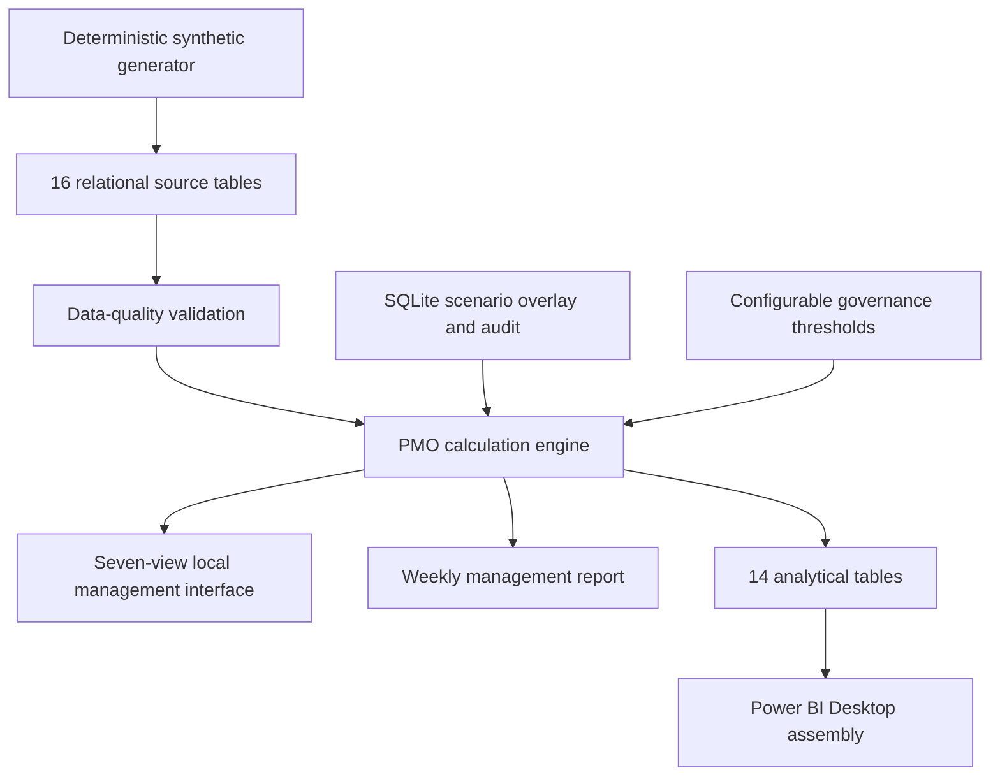
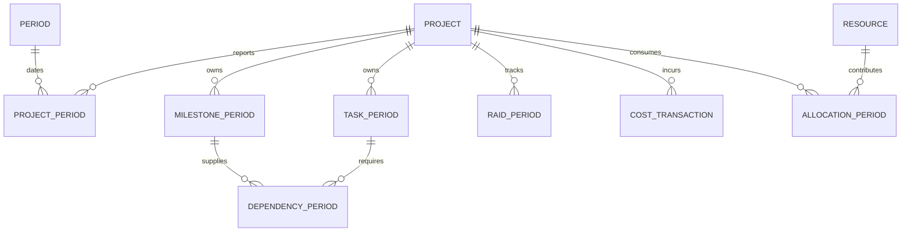
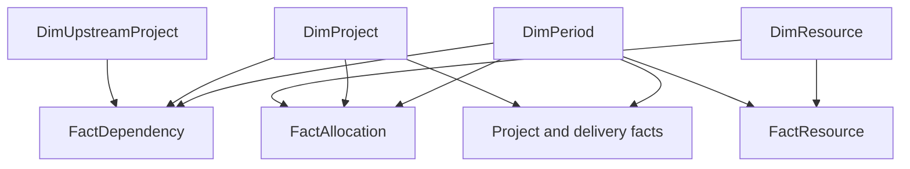
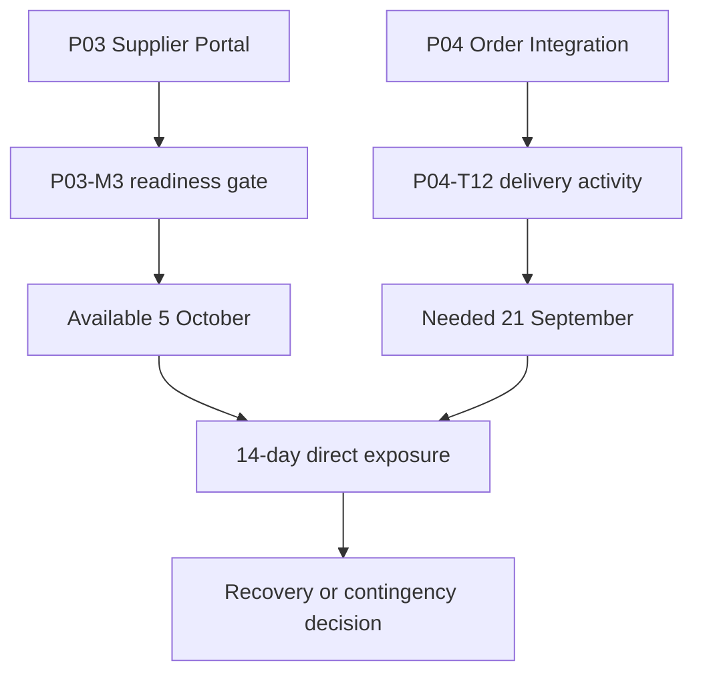
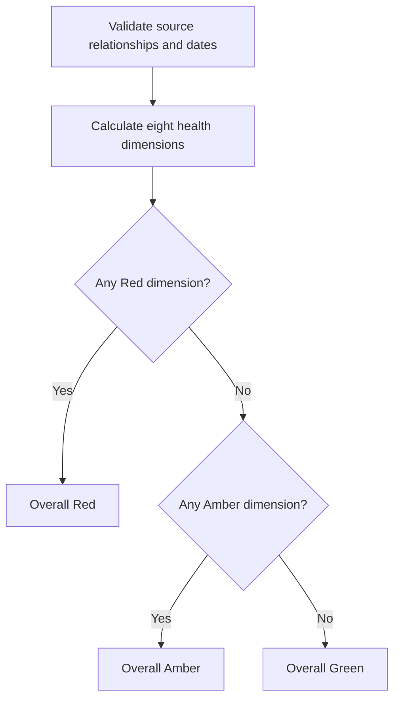

# Architecture and reporting flow

This is a local portfolio-management system, separate from the existing automation project. No n8n integration, external account, scheduler or notification infrastructure is required.

The runtime is Python's standard library plus a browser. The interface uses local HTML/CSS/JavaScript with no CDN requests. `server.py` exposes a small local API. `engine.py` calculates both UI and export values. `store.py` persists only scenario changes and the audit trail. No runtime web framework or paid analytics service is needed.

## Data model

Raw data is normalized into project, department, person, resource, period, status, milestone, task, risk, issue, action, assumption, dependency, budget, cost and allocation tables. `portfolio.json` is the canonical typed runtime bundle **containing those separate tables**, not one flattened project table. Individual raw CSVs are equivalent generated extracts for inspection. Editing a raw CSV alone does not update the canonical JSON; use the generator or scenario interface.

`PROJECT_PERIOD` is the processed project-period fact. `RAID_PERIOD` is a diagram shorthand for the separate risk, issue, action and assumption source tables; it is not a combined implementation table. Milestone and task joins use the entity ID **and reporting date**, so snapshots from different periods cannot be joined accidentally.

## Power BI star schema

Four dimensions: DimProject (department and accountability attributes denormalized), DimPeriod, DimResource and DimUpstreamProject. Ten facts: project, milestone, task, risk, issue, action, dependency, allocation, resource and cost. Grain and types are recorded in `powerbi/table-schemas.json`; relationships in `powerbi/relationships.csv`.

All relationships are one-to-many, active and single-direction. FactCost is transaction-grain; its date relationship uses transaction_date. Snapshot financial totals use FactProject cumulative actual_cost, not a sum of repeated cumulative rows across periods. FactResource is resource-period grain and has no project relationship. This prevents multiplying resource capacity by the number of allocations.

## Dependency model

An upstream scenario forecast change affects all direct receiving edges during recalculation. No automatic downstream project replan or recursive critical-path propagation is performed.

## Health flow

## Interface/API and error handling

| Route | Purpose |
|---|---|
| GET /api/meta | Periods, departments, configuration and same-session write token |
| GET /api/portfolio | Filtered live calculations and history through the selected period |
| GET /api/report | Reproducible Markdown report for the same filters |
| GET /api/audit | Most recent 100 scenario changes |
| POST /api/change | Validated edit, rule change or scenario reset with revision check |
| POST /api/export | Write scenario-aware analytical CSVs and report to output/ |

Validation errors return 422 and leave the transaction unchanged. Stale revisions fail instead of overwriting another browser's changes. All writes require a per-process token; cross-origin write requests are rejected. Baseline data is loaded at startup, so regenerate source files only with the server stopped, then restart. Logs record method and route, not request payloads. Unexpected failures return a generic error and a local server traceback.

## Performance and deployment boundary

The bundled scale is 18 projects and 12 periods. Calculation is in memory; source validation occurs at startup and before saved record edits. History is recomputed for the visible reporting horizon. This is not a throughput benchmark or a multi-tenant production deployment. The optional Docker recipe improves reproducibility for users already using Docker but was not executed in this environment.
